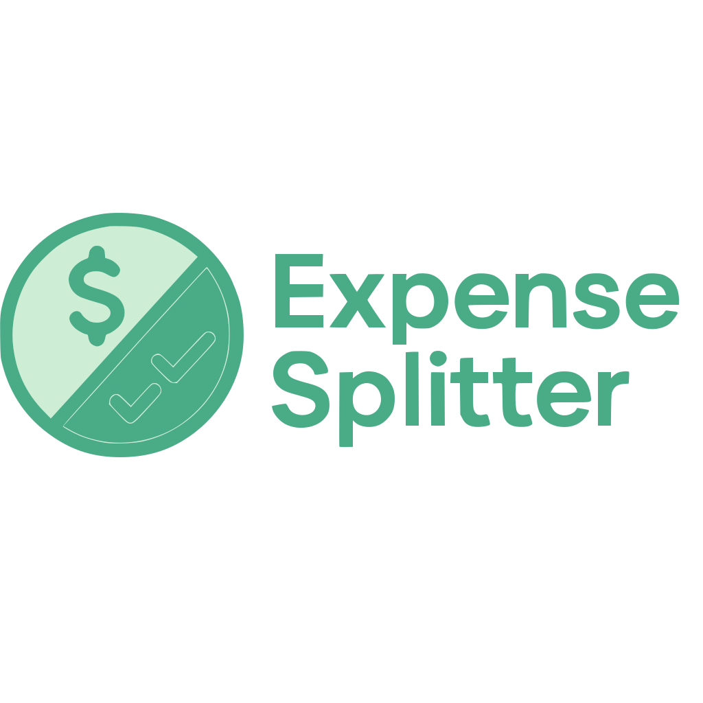

> *A simple way to track and split expenses with friends.*

**Expense Splitter** is a lightweight web application designed to help groups of people track shared expenses and calculate how to settle up.

## How to use

Just create a group, add the participants and start recording expenses as they happen. For each expense:
- Select who paid.
- Choose who participated. (including guests that may not be part of your *regular* group)
- The app **automatically calculates** who owes what to whom.

When it's time to settle up, check the **Balances** tab to see the simplest way for everyone to pay each other back.

Need to share with friends? Use the **Share** button to generate a QR code or link that others can use to import the group.

### Sharing a Group

1. Open the group and tap "**Share**"
2. **Share via QR code:** Let others scan the displayed code
3. **Share via link:** Copy the link and send it through any messaging app
   
When someone opens your shared link or scans the QR code, the group is automatically imported into their app.

## Technical Details

Built with vanilla JavaScript, HTML, and CSS.

**No external dependencies required!** Data is stored in your browser's localStorage and shared using LZString compression, making the entire application lightweight and fast.

## Inspiration

This project was inspired by the need for a simple, privacy-focused expense splitting tool that works across all devices without requiring account creation or installation.

*Unlike other solutions that require accounts or charge fees for more *"slots"*, Expense Splitter is completely free and respects your privacy.*

---

### [Try Expense Splitter Today](https://devnove.github.io/Expense-Splitter/)
